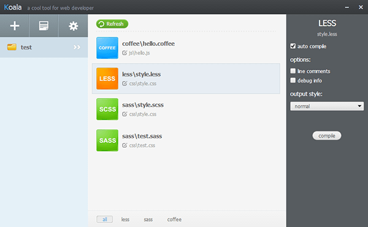

# koala

> koala是一个前端预处理器语言图形编译工具，支持Less、Sass、Compass、CoffeeScript，帮助web开发者更高效地使用它们进行开发。跨平台运行，完美兼容windows、linux、mac。[使用文档](http://koala-app.com/index-zh.html#)

## less

> Less 是一门 CSS预处理语言,它扩展了 CSS语言,增加了变量、Mixin、函数等特性。Less可以运行在 Node或浏览器端。[官网](http://lesscss.cn/)
