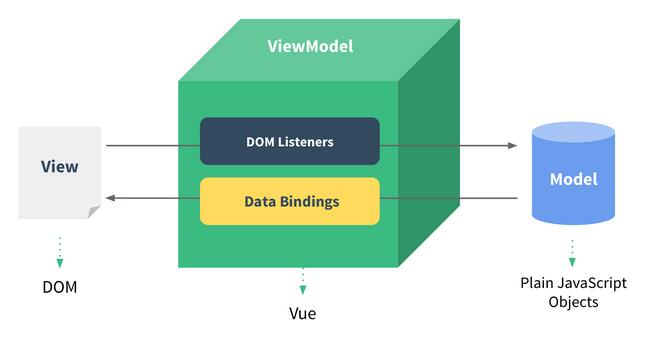
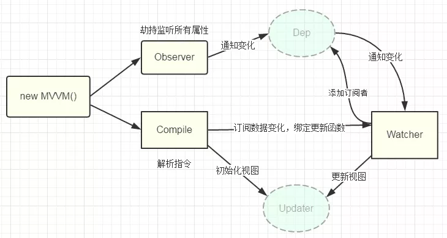

# Vue

>[Vue官网](https://cn.vuejs.org/)

Vue.js是JavaScript MVVM（Model-View-ViewModel）库，十分简洁，Vue核心只关注视图层，相对AngularJS提供更加简洁、易于理解的API。Vue尽可能通过简单的API实现响应的数据绑定和组合的视图组件。

> Vue常见面试题

## 什么是MVVM模式

Vue.js是JavaScript的MVVM（Model-View-ViewModel）库，十分简洁，Vue核心只关注视图层，相对其他框架提供更加简洁、易于理解的API。Vue尽可能通过简单的API实现响应的数据绑定和组合的视图组件。

Vue是以数据为驱动的，Vue自身将DOM和数据进行绑定，一旦创建绑定，DOM和数据将保持同步，每当数据发生变化，DOM会跟着变化。

ViewModel是Vue的核心，它是Vue的一个实例。Vue实例时作用域某个HTML元素上的，这个HTML元素可以是body，也可以是某个id所指代的元素。



DOM Listeners和Data Bindings是实现双向绑定的关键。DOM Listeners监听页面所有View层DOM元素的变化，当发生变化，Model层的数据随之变化；Data Bindings监听Model层的数据，当数据发生变化，View层的DOM元素随之变化。

## Vue原理

1. 原理
Vue的双向数据绑定的原理相信大家也都十分了解了，主要是通过 `Object`对象的`defineProperty`属性，重写data的set和get函数来实现的,这里对原理不做过多描述，主要还是来实现一个实例。为了使代码更加的清晰，这里只会实现最基本的内容，主要实现v-model，v-bind 和v-click三个命令，其他命令也可以自行补充。



2. 实现

页面结构：

```html
<div id="app">
    <form>
      <input type="text"  v-model="number">
      <button type="button" v-click="increment">增加</button>
    </form>
    <h3 v-bind="number"></h3>
  </div>

```

包含：

 1. 一个input，使用v-model指令
 2. 一个button，使用v-click指令
 3. 一个h3，使用v-bind指令。
我们最后会通过类似于vue的方式来使用我们的双向数据绑定，结合我们的数据结构添加注释
```js
var app = new myVue({
      el:'#app',
      data: {
        number: 0
      },
      methods: {
        increment: function() {
          this.number ++;
        },
      }
    })
    ```
首先我们需要定义一个myVue构造函数：

```js
function myVue(options) {
  
}
```

为了初始化这个构造函数，给它添加一 个_init属性

```js
function myVue(options) {
  this._init(options);
}
myVue.prototype._init = function (options) {
    this.$options = options;  // options 为上面使用时传入的结构体，包括el,data,methods
    this.$el = document.querySelector(options.el); // el是 #app, this.$el是id为app的Element元素
    this.$data = options.data; // this.$data = {number: 0}
    this.$methods = options.methods;  // this.$methods = {increment: function(){}}
  }
  ```

接下来实现_obverse函数，对data进行处理，重写data的set和get函数并改造_init函数

```js
 myVue.prototype._obverse = function (obj) { // obj = {number: 0}
    var value;
    for (key in obj) {  //遍历obj对象
      if (obj.hasOwnProperty(key)) {
        value = obj[key]; 
        if (typeof value === 'object') {  //如果值还是对象，则遍历处理
          this._obverse(value);
        }
        Object.defineProperty(this.$data, key, {  //关键
          enumerable: true,
          configurable: true,
          get: function () {
            console.log(`获取${value}`);
            return value;
          },
          set: function (newVal) {
            console.log(`更新${newVal}`);
            if (value !== newVal) {
              value = newVal;
            }
          }
        })
      }
    }
  }
 
 myVue.prototype._init = function (options) {
    this.$options = options;
    this.$el = document.querySelector(options.el);
    this.$data = options.data;
    this.$methods = options.methods;
   
    this._obverse(this.$data);
  }
  ```

接下来我们写一个指令类Watcher，用来绑定更新函数，实现对DOM元素的更新

```js
function Watcher(name, el, vm, exp, attr) {
    this.name = name;         //指令名称，例如文本节点，该值设为"text"
    this.el = el;             //指令对应的DOM元素
    this.vm = vm;             //指令所属myVue实例
    this.exp = exp;           //指令对应的值，本例如"number"
    this.attr = attr;         //绑定的属性值，本例为"innerHTML"

    this.update();
  }

  Watcher.prototype.update = function () {
    this.el[this.attr] = this.vm.$data[this.exp]; //比如 H3.innerHTML = this.data.number; 当number改变时，会触发这个update函数，保证对应的DOM内容进行了更新。
  }
  ```

更新_init函数以及_obverse函数

```js
myVue.prototype._init = function (options) {
    //...
    this._binding = {};   //_binding保存着model与view的映射关系，也就是我们前面定义的Watcher的实例。当model改变时，我们会触发其中的指令类更新，保证view也能实时更新
    //...
  }
 
  myVue.prototype._obverse = function (obj) {
    //...
      if (obj.hasOwnProperty(key)) {
        this._binding[key] = {    // 按照前面的数据，_binding = {number: _directives: []}                                                                                                                                                  
          _directives: []
        };
        //...
        var binding = this._binding[key];
        Object.defineProperty(this.$data, key, {
          //...
          set: function (newVal) {
            console.log(`更新${newVal}`);
            if (value !== newVal) {
              value = newVal;
              binding._directives.forEach(function (item) {  // 当number改变时，触发_binding[number]._directives 中的绑定的Watcher类的更新
                item.update();
              })
            }
          }
        })
      }
    }
  }
  ```

那么如何将view与model进行绑定呢？接下来我们定义一个_compile函数，用来解析我们的指令（v-bind,v-model,v-clickde）等，并在这个过程中对view与model进行绑定。

```js
 myVue.prototype._init = function (options) {
   //...
    this._complie(this.$el);
  }
 
myVue.prototype._complie = function (root) { root 为 id为app的Element元素，也就是我们的根元素
    var _this = this;
    var nodes = root.children;
    for (var i = 0; i < nodes.length; i++) {
      var node = nodes[i];
      if (node.children.length) {  // 对所有元素进行遍历，并进行处理
        this._complie(node);
      }

      if (node.hasAttribute('v-click')) {  // 如果有v-click属性，我们监听它的onclick事件，触发increment事件，即number++
        node.onclick = (function () {
          var attrVal = nodes[i].getAttribute('v-click');
          return _this.$methods[attrVal].bind(_this.$data);  //bind是使data的作用域与method函数的作用域保持一致
        })();
      }

      if (node.hasAttribute('v-model') && (node.tagName == 'INPUT' || node.tagName == 'TEXTAREA')) { // 如果有v-model属性，并且元素是INPUT或者TEXTAREA，我们监听它的input事件
        node.addEventListener('input', (function(key) {  
          var attrVal = node.getAttribute('v-model');
           //_this._binding['number']._directives = [一个Watcher实例]
           // 其中Watcher.prototype.update = function () {
           //    node['vaule'] = _this.$data['number'];  这就将node的值保持与number一致
           // }
          _this._binding[attrVal]._directives.push(new Watcher(  
            'input',
            node,
            _this,
            attrVal,
            'value'
          ))

          return function() {
            _this.$data[attrVal] =  nodes[key].value; // 使number 的值与 node的value保持一致，已经实现了双向绑定
          }
        })(i));
      } 

      if (node.hasAttribute('v-bind')) { // 如果有v-bind属性，我们只要使node的值及时更新为data中number的值即可
        var attrVal = node.getAttribute('v-bind');
        _this._binding[attrVal]._directives.push(new Watcher(
          'text',
          node,
          _this,
          attrVal,
          'innerHTML'
        ))
      }
    }
  }
  ```

至此，我们已经实现了一个简单vue的双向绑定功能，包括v-bind, v-model, v-click三个指令。效果如下图


附上全部代码，不到150行

```html
<!DOCTYPE html>
<head>
  <title>myVue</title>
</head>
<style>
  #app {
    text-align: center;
  }
</style>
<body>
  <div id="app">
    <form>
      <input type="text"  v-model="number">
      <button type="button" v-click="increment">增加</button>
    </form>
    <h3 v-bind="number"></h3>
  </div>
</body>

<script>
  function myVue(options) {
    this._init(options);
  }

  myVue.prototype._init = function (options) {
    this.$options = options;
    this.$el = document.querySelector(options.el);
    this.$data = options.data;
    this.$methods = options.methods;

    this._binding = {};
    this._obverse(this.$data);
    this._complie(this.$el);
  }
 
  myVue.prototype._obverse = function (obj) {
    var value;
    for (key in obj) {
      if (obj.hasOwnProperty(key)) {
        this._binding[key] = {                                                                                                                                                          
          _directives: []
        };
        value = obj[key];
        if (typeof value === 'object') {
          this._obverse(value);
        }
        var binding = this._binding[key];
        Object.defineProperty(this.$data, key, {
          enumerable: true,
          configurable: true,
          get: function () {
            console.log(`获取${value}`);
            return value;
          },
          set: function (newVal) {
            console.log(`更新${newVal}`);
            if (value !== newVal) {
              value = newVal;
              binding._directives.forEach(function (item) {
                item.update();
              })
            }
          }
        })
      }
    }
  }

  myVue.prototype._complie = function (root) {
    var _this = this;
    var nodes = root.children;
    for (var i = 0; i < nodes.length; i++) {
      var node = nodes[i];
      if (node.children.length) {
        this._complie(node);
      }

      if (node.hasAttribute('v-click')) {
        node.onclick = (function () {
          var attrVal = nodes[i].getAttribute('v-click');
          return _this.$methods[attrVal].bind(_this.$data);
        })();
      }

      if (node.hasAttribute('v-model') && (node.tagName == 'INPUT' || node.tagName == 'TEXTAREA')) {
        node.addEventListener('input', (function(key) {
          var attrVal = node.getAttribute('v-model');
          _this._binding[attrVal]._directives.push(new Watcher(
            'input',
            node,
            _this,
            attrVal,
            'value'
          ))

          return function() {
            _this.$data[attrVal] =  nodes[key].value;
          }
        })(i));
      } 

      if (node.hasAttribute('v-bind')) {
        var attrVal = node.getAttribute('v-bind');
        _this._binding[attrVal]._directives.push(new Watcher(
          'text',
          node,
          _this,
          attrVal,
          'innerHTML'
        ))
      }
    }
  }

  function Watcher(name, el, vm, exp, attr) {
    this.name = name;         //指令名称，例如文本节点，该值设为"text"
    this.el = el;             //指令对应的DOM元素
    this.vm = vm;             //指令所属myVue实例
    this.exp = exp;           //指令对应的值，本例如"number"
    this.attr = attr;         //绑定的属性值，本例为"innerHTML"

    this.update();
  }

  Watcher.prototype.update = function () {
    this.el[this.attr] = this.vm.$data[this.exp];
  }

  window.onload = function() {
    var app = new myVue({
      el:'#app',
      data: {
        number: 0
      },
      methods: {
        increment: function() {
          this.number ++;
        },
      }
    })
  }
</script>
```

## 对vue虚拟dom了解么？

## Vuex

### Vuex是什么？

Vuex 是一个专为 Vue.js应用程序开发的状态管理模式。它采用集中式存储管理应用的所有组件的状态，并以相应的规则保证状态以一种可预测的方式发生变化。

这个状态自管理应用包含以下几个部分：

- state，驱动应用的数据源；
- view，以声明方式将 state 映射到视图；
- actions，响应在 view 上的用户输入导致的状态变化。

以下是一个表示“单向数据流”理念的极简示意：


但是，当我们的应用遇到多个组件共享状态时，单向数据流的简洁性很容易被破坏：

- 多个视图依赖于同一状态。
- 来自不同视图的行为需要变更同一状态。

对于问题一，传参的方法对于多层嵌套的组件将会非常繁琐，并且对于兄弟组件间的状态传递无能为力。对于问题二，我们经常会采用父子组件直接引用或者通过事件来变更和同步状态的多份拷贝。以上的这些模式非常脆弱，通常会导致无法维护的代码。

因此，我们为什么不把组件的共享状态抽取出来，以一个全局单例模式管理呢？在这种模式下，我们的组件树构成了一个巨大的“视图”，不管在树的哪个位置，任何组件都能获取状态或者触发行为！

**另外，通过定义和隔离状态管理中的各种概念并强制遵守一定的规则，我们的代码将会变得更结构化且易维护。**

这就是 Vuex 背后的基本思想

## vue的生命周期有哪些？


`beforeCreate`	在实例初始化之后，数据观测(data observer) 和 event/watcher 事件配置之前被调用。

`created`	实例已经创建完成之后被调用。在这一步，实例已完成以下的配置：数据观测(data observer)，属性和方法的运算， watch/event 事件回调。然而，挂载阶段还没开始，$el 属性目前不可见。

`beforeMount`	在挂载开始之前被调用：相关的 render 函数首次被调用。

`mounted`	el 被新创建的 vm.$el 替换，并挂载到实例上去之后调用该钩子。如果 root 实例挂载了一个文档内元素，当 mounted 被调用时 vm.$el 也在文档内。

`beforeUpdate`	数据更新时调用，发生在虚拟 DOM 重新渲染和打补丁之前。你可以在这个钩子中进一步地更改状态，这不会触发附加的重渲染过程。

`updated`	由于数据更改导致的虚拟 DOM 重新渲染和打补丁，在这之后会调用该钩子。当这个钩子被调用时，组件 DOM 已经更新，所以你现在可以执行依赖于 DOM 的操作。

`activated`	keep-alive 组件激活时调用。

`deactivated`	keep-alive 组件停用时调用。

`beforeDestroy`   实例销毁之前调用。在这一步，实例仍然完全可用。

`destroyed`   Vue 实例销毁后调用。调用后，Vue 实例指示的所有东西都会解绑定，所有的事件监听器会被移除，所有的子实例也会被销毁。
